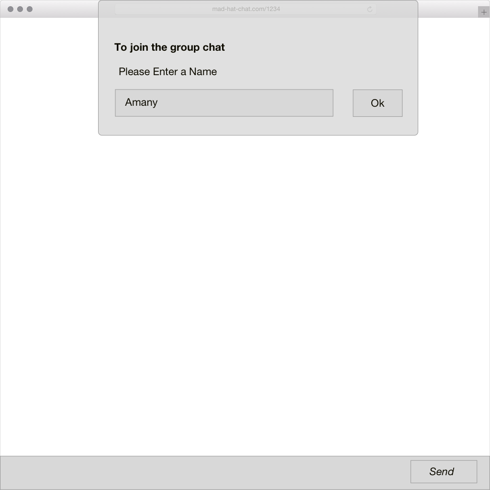

[](https://generalassemb.ly/education/web-development-immersive)

# Mad Hat Group Chat


## Introduction 

Fourth and final project in General Assembly's course 'Web Development Immersive'.
This project requirments were building a full stack web application, using React as a front end framework interacting a backend api along with building the database.

## Project Description 

This web application offers the service of live chatting in more than one chat rooms with the other apps users.

[server-side](https://github.com/hamoghamdi/final-project-backend)

---
## Prerequisites

npm  
```
$ npm install
```

Run server
```
$npm start
```

---
## User Stories
**Version 1**  

- User must be able to sign up or sign in using email and password
- User must be able to sign out and change password
- User must be able to join in the chat room and have a nickname 
- User must be able to send and recive messages while in the chat room

**Version 2**  
- User must be able to create a chat room with a title
- User must be able to join in a chat room created by them or other users
- User must be able to view thier chatrooms 
- User must be able to delete thier chatrooms
- User must be able to send and recive emojis 


## Wireframes
<!-- Home page -->

<!-- Sign Up -->
 
<!-- Sign In -->
 
<!-- User Home Page -->
 
<!-- My Chat Rooms -->
 
<!-- Join a Chat room -1 -->
 
<!-- Join a chat room -2 -->
 


## Technologies
<!-- **Front-end:** -->
- React.js
- socket.io 
- CSS
<!-- 
**Back-end:**
- Express.js
- Node.js
- Socket.io -->

## Demo
- [Mad Hat Group Chat](https://hamoghamdi.github.io/final-project-frontend/#/)

## Resourses 
- A React component [emoji-mart](https://github.com/missive/emoji-mart)
- Socket.io

